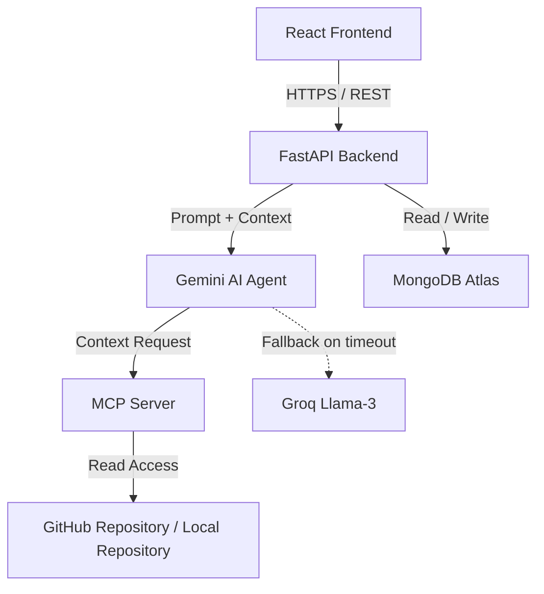
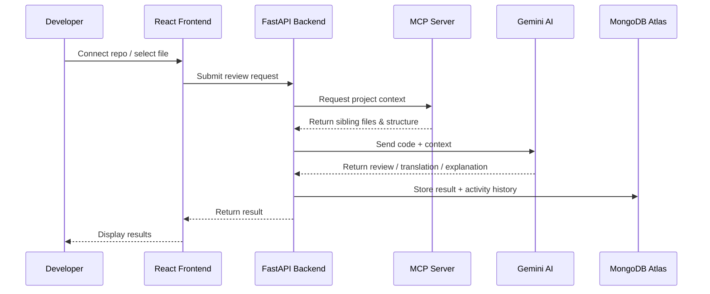

<div align="center">

# 🧠 KRITIQ

### AI-Powered Code Review & Cross-Language Translation Agent

*Reviews and translates code with actual project context — not just the file in front of it.*

[]()
[]()
[]()
[]()
[]()
[]()
[]()

**[Live App](https://kritiq-navy.vercel.app/)** · **[API Docs](https://kritiq.onrender.com/docs)** · **[CLI Reference](#-command-line-interface)**

</div>

---

## 💡 Why Kritiq Exists

Most AI coding assistants review one file in isolation. A function can look perfectly fine on its own and still violate a convention used everywhere else in the project, or quietly duplicate logic that already exists three files away — and a tool that only sees what's pasted in front of it will never catch that.

Kritiq closes that gap using **Model Context Protocol (MCP)** to pull real project context — sibling files, structure, related definitions — *before* asking Gemini to reason about a piece of code. The result is a review that understands the codebase it's sitting inside, not just the text on screen.

---

## ✨ Features

### 🔍 AI-Powered Code Review
Severity-tagged issues (Critical / Medium / Low), root-cause explanations, and production-ready suggested fixes — grounded in real MCP-retrieved project context, not generic style rules.

### 🌐 Cross-Language Code Translation
Converts code between languages while preserving logic, not just syntax — Python ⇄ Java, JavaScript, TypeScript, Go, Rust, C/C++, and more.

### 📖 Plain-Language Explanations
Ask Kritiq what a file actually does, and get an architecture-aware, human-readable walkthrough instead of a line-by-line paraphrase.

### 🗂️ GitHub Repository Integration
Connect a real GitHub repo, browse its file tree, and run reviews/translations/explanations directly against live repository content — with a local-clone fallback (GitPython) if the GitHub API is ever rate-limited.

### 🧩 Context-Aware Reasoning via MCP
A real Model Context Protocol server retrieves sibling files and project structure on demand, injecting that context directly into the Gemini prompt — confirmed live in production, not just in theory.

### 🔁 Zero-Downtime AI Fallback
Every AI-powered command runs on a dual-engine setup: **Gemini 2.5 Flash** as the primary reasoning engine, with automatic, seamless failover to **Groq Llama-3** on timeout or overload — no broken requests, no manual retries.

### 🔐 Secure Authentication
JWT-based sessions with bcrypt password hashing, a clean session-expiry experience (no silent logouts), and protected routes throughout the app.

### 🖥️ Dashboard & History
A real-time dashboard with activity stats and recent actions, plus a full history log of every review, translation, and explanation — each fully revisitable with the original code and AI output intact.

### 💻 Full-Featured CLI
Everything the web app can do, from the terminal — built with Typer, distributed as a proper installable package, and running on the exact same backend as the web app (no duplicated logic).

### 💬 Interactive AI Chat
A multi-turn chat mode for asking follow-up questions about your code, a review, or a file — directly from the terminal or the web dashboard.

---

## 🏗️ System Architecture


```mermaid
graph TD
    A[React Frontend] -->|HTTPS / REST| B[FastAPI Backend]
    B -->|Prompt + Context| C[Gemini AI Agent]
    C -->|Context Request| D[MCP Server]
    D -->|Read Access| E[GitHub Repository / Local Repository]
    B -->|Read / Write| F[MongoDB Atlas]
    C -.->|Fallback on timeout| G[Groq Llama-3]
```

Kritiq is built as a strictly layered system:

| Layer | Responsibility |
|---|---|
| **React Frontend** | Presentation and user interaction |
| **FastAPI Backend** | Business logic, authentication, request orchestration |
| **Gemini AI Agent** | Reasoning — review, translation, explanation |
| **MCP Server** | Context retrieval from connected repositories |
| **GitHub / Local Repository** | Source of project code and structure |
| **MongoDB Atlas** | Persistent storage for users, reviews, translations, and history |

The frontend never talks to the AI or MCP layers directly — every request is routed and validated through the backend, keeping the CLI and web app fully interchangeable on top of the same engine.

---

## 🔄 How a Review Actually Happens


```mermaid
sequenceDiagram
    participant U as Developer
    participant F as React Frontend
    participant B as FastAPI Backend
    participant M as MCP Server
    participant G as Gemini AI
    participant D as MongoDB Atlas

    U->>F: Connect repo / select file
    F->>B: Submit review request
    B->>M: Request project context
    M-->>B: Return sibling files & structure
    B->>G: Send code + context
    G-->>B: Return review / translation / explanation
    B->>D: Store result + activity history
    B-->>F: Return result
    F-->>U: Display results
```

1. **Login** — JWT-based authentication establishes a session
2. **Connect / Upload** — connect a GitHub repo or paste code directly
3. **Backend Processing** — the request is validated and routed
4. **MCP Retrieves Context** — sibling files and structure are pulled in for connected repos
5. **Gemini Analyzes** — the AI reasons over the code *with* project context
6. **Result Generated** — a review, translation, or explanation comes back
7. **History Stored** — everything is saved to MongoDB Atlas for later
8. **Displayed** — shown in the web dashboard or printed directly in the terminal

---

## 🛠️ Tech Stack

<table>
<tr><td valign="top" width="50%">

**Frontend**
- React.js
- Tailwind CSS
- Monaco Editor
- Axios
- React Router DOM

**Backend**
- Python + FastAPI
- Pydantic
- JWT Authentication
- Uvicorn

**AI & Reasoning**
- Google Gemini 2.5 Flash
- Groq Llama-3 (fallback)
- RAG pipeline (curated dataset of review patterns)

</td><td valign="top" width="50%">

**Context & Repository Integration**
- Model Context Protocol (Python MCP SDK)
- GitHub API
- GitPython (local-clone fallback)

**Database**
- MongoDB Atlas
- PyMongo

**CLI**
- Python + Typer

**Deployment**
- Frontend → Vercel
- Backend → Render
- Database → MongoDB Atlas

</td></tr>
</table>

---

## 💻 Command Line Interface

Kritiq ships a full terminal-first experience with 7 commands, all talking to the exact same backend as the web app:

```bash
kritiq login --email you@example.com     # Authenticate and store session token
kritiq init                              # Initialize .kritiq.json + .kritiqignore
kritiq review app/main.py                # AI-powered code review
kritiq diff HEAD~3                       # Review changed lines from a git ref
kritiq translate app.py --to java        # Cross-language translation
kritiq explain auth.py                   # Plain-language explanation
kritiq chat                              # Interactive multi-turn AI chat
```

```
$ kritiq review app/main.py
Reviewing app/main.py (detected language: python)...

1 Critical
3 Suggestions

✔ Review walkthrough saved.
```

Configuration lives in a simple `.kritiq.json`:

```json
{
  "version": "2.4.12-stable",
  "engine": "gemini-2.5-flash",
  "max_file_size_kb": 500,
  "rules": ["security", "performance", "code_smells"]
}
```

---

## ✅ Verified in Production

Every feature above has been tested end-to-end against the live deployment — not just reviewed in code:

- Real Gemini-generated output confirmed live across review, translation, and explanation
- MCP context retrieval confirmed via live server logs actually injecting sibling-file context into the Gemini prompt
- GitHub API integration confirmed live; GitPython fallback confirmed triggering automatically under a real rate limit
- Full auth flow (register → login → session → expiry handling) confirmed live with real JWT payloads
- History and revisit pages confirmed for all three activity types
- All three deployment targets (Vercel, Render, MongoDB Atlas) confirmed live and connected

---

## 📂 Project Structure

```
kritiq-backend/
├── ai_agent/          # Gemini + Groq clients, review/translation/explanation services, prompt engineering
├── mcp_server/         # Model Context Protocol server and tools
├── rag_pipeline/       # Retrieval-augmented context for review prompts
├── repo_integration/   # GitHub API + GitPython local-clone fallback
├── cli/                # Typer-based command line interface
├── app/                # FastAPI application: routes, models, auth, database
└── tests/              # Backend test suite

kritiq-frontend/
├── src/pages/          # Dashboard, Login, Review/Translation/Explanation results, History
├── src/components/     # Monaco editor wrapper, issue lists, navigation
├── src/api/            # Axios-based API layer
└── src/context/        # Authentication context
```

---

## 🚀 Getting Started

```bash
# Backend
cd kritiq-backend
pip install -r requirements.txt
uvicorn app.main:app --reload

# Frontend
cd kritiq-frontend
npm install
npm run dev

# CLI
cd kritiq-backend
pip install -e .
kritiq --help
```

---

## 🔮 Future Enhancements

- VS Code extension for in-editor access
- GitLab and Bitbucket integration
- Automated pull request reviews on new commits
- Team collaboration features (shared review history, comments)
- CI/CD pipeline integration for automated reviews on build

---

<div align="center">

*Built to make code review understand the codebase it's reviewing — not just the file in front of it.*

</div>
