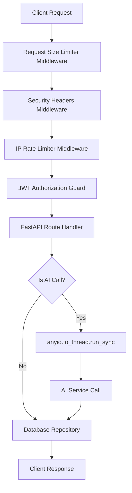

# System Architecture — KRITIQ Backend

This document details the backend architectural structure, file layouts, API flow, database structure, and AI service integration mapping.

---

## 1. Directory Structure

```text
kritiq-backend/
├── app/
│   ├── auth/            # JWT validation, password hashing, and dependency hooks
│   ├── core/            # Config variables, global exception handlers, and rate limiter
│   ├── db/              # MongoClient singleton and database repository files
│   ├── models/          # Pydantic schemas mapping request and response structures
│   ├── routes/          # API routers (auth, review, translation, explanation, history)
│   ├── main.py          # FastAPI application constructor, middleware, and route registrations
│   └── playground.py    # Sequential integration test checker
├── checks/              # Independent diagnostics scripts for database, API, and performance
└── tests/               # Pytest test suite asserting endpoint behaviors
```

---

## 2. Request Processing Pipeline



---

## 3. Database Collection Map

* **`users`**: Stores client name, email (unique index), and hashed passwords.
* **`reviews`**: Stores code reviews mapped to a `user_id`. Includesparsed summary, structural issues, and raw output.
* **`translations`**: Mapped translation logs storing source code, target languages, and translations.
* **`history`**: Flat logging collection recording timestamped user events (`type`, `summary`, `details`).

---

## 4. Integration Routing
* FastAPI handlers defined as `async def` offload heavy, CPU-bound bcrypt or slow remote Gemini/Groq API network operations to worker threads via `anyio` or standard threadpools. This protects the event loop from being blocked by third-party latency.
